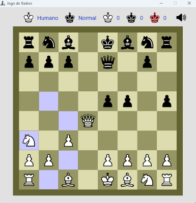

# Italo Xadrez

Veja abaixo uma captura de tela do jogo em execução:



Este jogo de xadrez foi construído em C++. 


Atenção: essas versões do sistema foram compiladas para arquitetura "x86_64". Não foram criadas versões para arquitetura "i686" ou de 32 bits. A razão pra isto é que seria mais 
difícil de manter tantas versões do sistema e, como sistemas de 32 bits e que funcionam em arquitetura i686 ou anterior são antigos, é pouco provável que um possível usuário do 
Italo Xadrez esteja utilizando um sistema desses hoje em dia.

Se estiver no linux e quiser saber a arquitetura do SO, basta digitar o seguinte comando 
no terminal:

```
uname -m
```

## Executando no windows

Para executar no windows, basta baixar o instalador na release mais recente do repositório. O instalador tem o nome: "italo-xadrez-x.x-windows-x64.exe", onde o x.x é a versão do projeto. 

Para executar no windows sem instalador, basta baixar a versão zipada para windows na release mais recente do repositório e descompactar e executar o arquivo "italo-xadrez.exe". Por exemplo, o arquivo zipado deve ter o nome: "italo-xadrez-x.x-windows-x64.zip" onde o x.x é a versão do projeto.

## Executando no linux

Para executar em alguma distribuição linux compativel com o x86_64, você pode baixar a versão .deb, se estiver no debian (ou derivados), ou baixar o arquivo de nome: "italo-xadrez-x.x-x64.tar.gz". Ambos podem ser baixados da release mais recente do repositório.

### Versão .deb

Se preferir a <b>versão .deb</b>, faça o seguinte: Baixe o arquivo "italo-xadrez-x.x-x64.deb" e execute o seguinte comando:

```
sudo dpkg -i ./italo-xadrez-x.x-x64.deb
```

Agora você pode executar pelo terminal digitando: italo-xadrez, ou buscar no sistema pelo programa Italo Xadrez.

Para desinstalar execute o seguinte:

```
sudo dpkg -r italo-xadrez
```

Lembrando que o x.x deve ser substituído pela versão.

### Versão .tar.gz

Se preferir a <b>versão .tar.gz</b>, baixe o arquivo "italo-xadrez-x.x-x64.tar.gz" e execute o seguinte:

```
tar -xvf italo-xadrez-2.2.tar.gz
cd italo-xadrez-2.2
./italo-xadrez
```

## Dependencia da ALSA

Para executar no tinycorelinux, ou outra distribuição linux que não tenha a ALSA - Advanced Linux Sound Architecture - instalada, é necessário instalar a ALSA. Em outras distribuições linux, geralmente, a ALSA já vem instalada por padrão.

## Executando no tinycorelinux

Para executar no tinycorelinux, é necessário baixar a versão .tar.gz, extrair, e utilizar o programa sh, conforme a seguir:

```
sh ./italo-xadrez
```

Atenção: Para funcionar no tinycorelinux, é necessário estar utilizando o tinycorelinux, versão x64, ao invés da versão i686. Você pode descobrir se a arquitetura é x86_64 ou i686 executando o seguinte comando:

```
uname -a
```

## Estrutura do projeto

<ul>
	<li>Os arquivos cabeçalhos (.h) e fonte (.cpp) estão na pasta "src".</li>
	<li>Na pasta "assets" é onde estão os recursos necessários para o jogo funcionar como: arquivos de audio, imagem e fonte.</li>
	<li>As bibliotecas estáticas e dinâmicas necessárias para o jogo ser linkado no windows estão na pasta "lib".</li>
    <li>Na pasta "include", estão os arquivos ".h" de cabeçalho do SDL2, necessários para compilar o projeto no windows.</li>
    <li>Na pasta "glibc-2.39" está o glibc-2.39 compilado no linux. O glibc é necessário para o sistema 
    funcionar em qualquer linux.</li>
    <li>O "cbuild.exe" e "cbuild" são programas, para windows e linux, que criei e que podem ser utilizados no processo de build. Isto é, compilar, linkar e outras tarefas.</li>
    <li>Os scripts "buildapp.sh" e "buildapp.bat" podem ser utilizados para executar o cbuild e outros comandos para buildar e empacotar o sistema.</li>
    <li>Os script "install-deps.sh" pode ser utilizado para instalar, ou remover, o SDL2 no linux ubuntu.</li>
    <li>O arquivo "italo-xadrez" é o script que executa a aplicação no linux. Ele será copiado para pasta de build do projeto.</li>
    <li>O script "gen_resource.bat" gera o arquivo de recurso de icone "icon.rc" para ser embutido no executável da aplicação no windows.</li>
</ul>
				
## Compilando e executando o build no linux?

Para compilar, linkar e copiar as dependências para uma pasta "libs", é necessário 
instalar o pacote build-essential e o SDL2, versão de desenvolvimento, no seu sistema operacional linux. Se estiver no ubuntu, pode executar os seguintes comandos:

```
sudo apt -y install build-essential
sudo apt -y install libsdl2-dev
sudo apt -y install libsdl2-mixer-dev
sudo apt -y install libsdl2-image-dev
sudo apt -y install libsdl2-ttf-dev
```

Ou instalar o build-essential e executar o seguinte script:

```
./install-deps.sh install dev
```

Feito isto, com o SDL2, o SDL2 mixer, o SDL2 image e o SDL2 ttf instalados, basta 
executar o seguinte script na raiz do projeto:

```
./buildapp.sh
```

Esse script utiliza um programa que criei: o "cbuild", que pode ser utilizado 
para build automático de aplicações C/C++.

Caso o build ocorra com sucesso, o software estará na pasta "build/italo-xadrez-x.x-x64", onde o "x.x" é a versão do projeto. Para executar o programa, basta entrar nessa pasta e executar como a seguir:

```
cd build/italo-xadrez-2.2
./italo-xadrez
```

Esse exemplo é para o caso da versão ser a "2.2"!

## Compilando e linkando no windows

Para compilar no windows, você pode utilizar o MinGW. 

Além do mingw, o projeto depende das bibliotecas: SDL2, SDL2_ttf, SDL2_mixer, SDL2_image. Essas bibliotecas (para compilar e linkar no windows) e os arquivos de cabeçalho estão, respectivamente, nas pastas "lib" e "include". Então vamos lá:

Se quiser desenvolver alguma aplicação em SDL2 com suporte a imagens, audio e fontes de texto, pode entrar no site: https://libsdl.org/ e baixar as seguintes bibliotecas:

```
	SDL2-2.32.8, 
	SDL2_mixer-2.8.1, 
	SDL2_image-2.8.8,
    SDL2_ttf
```

Claro, essas versões do SDL2 são necessárias para este projeto. Caso queira desenvolver o próprio, vai utilizar o SDL3 ou, caso já exista, uma versão superior. Os arquivos necessários do SDL para compilar e linkar já estão inclusos no projeto nas pastas "include" e "lib".
		
Muito bem, vamos compilar, linkar e concluír o build utilizando o cbuild. Então execute o seguinte comando:

```
.\cbuild.exe buildall --settings-file=settings-windows.txt
```

Ou execute o script conforme a seguir:

```
.\buildapp.bat
```

Se tudo correr bem, o projeto linkado e os arquivos necessários para ele funcionar deverão ser copiados para pasta: "build/italo-xadrez-x.x-windows-x64", onde x.x é a versão do projeto.

Para executar, é só entrar na pasta "build/italo-xadrez-x.x-windows-x64" e executar o programa "italo-xadrez.exe"

## Concluindo

Bem, para concluír, confesso que foi um desafio e tanto produzir esse software para 
windows e linux. A versão antiga para linux tinha um defeito que fazia o programa crashar e foi consertado nesta versão.